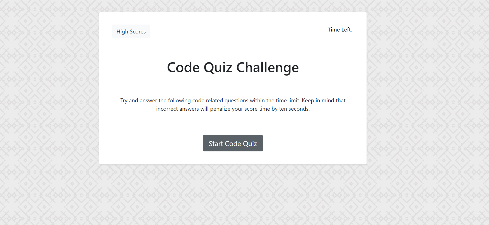

# codeQuiz

## Table of Contents

* [Link](#link)
* [Description](#description)
* [Images](#images)
* [Installation](#installation)
* [Usage](#usage)
* [Credits](#credits)
* [License](#license)

## Link

[https://aagrosse.github.io/codeQuiz/](https://aagrosse.github.io/codeQuiz/)

## Description 

This project is a code trivia challenge.  Click start to begin.  There are five questions total.  Correct/incorrect answers will move you to the next question but an incorrect answer will deduct 10 sec from the timer.  At the end your time remaining will be your score and you will be asked to enter your initials.  You are then redirected to the high scores page where you can clear the high scores or start the quiz over.  

## Images

## Installation

No notes needed

## Usage 

Use this challenge to test your basic code knowledge.

## Credits

no collaberators on this project.  Just me.

## License

no license needed.

